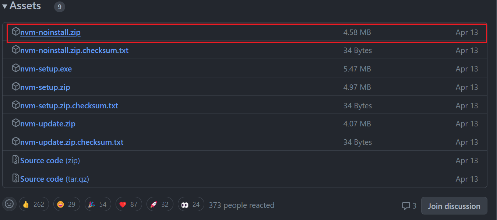
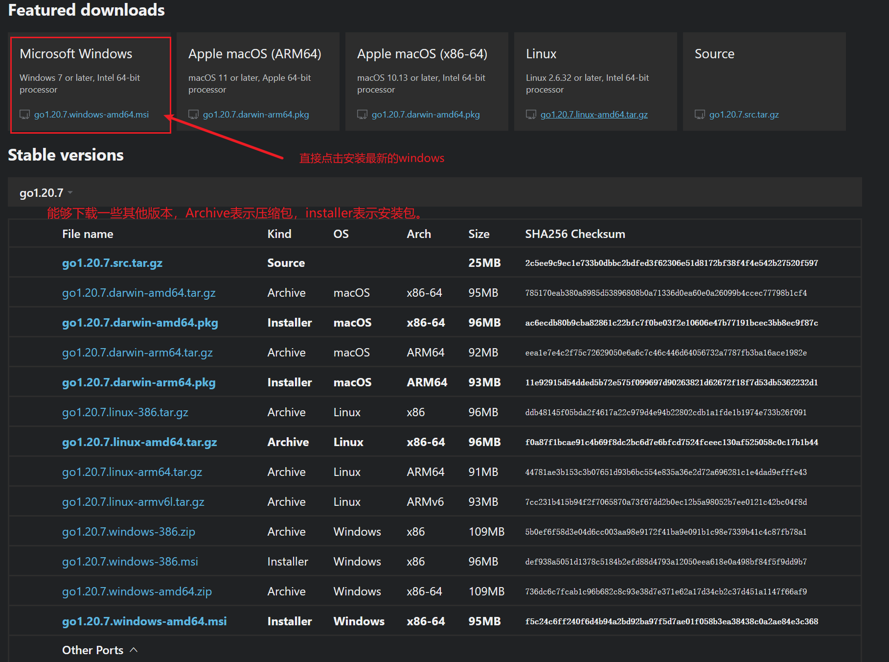
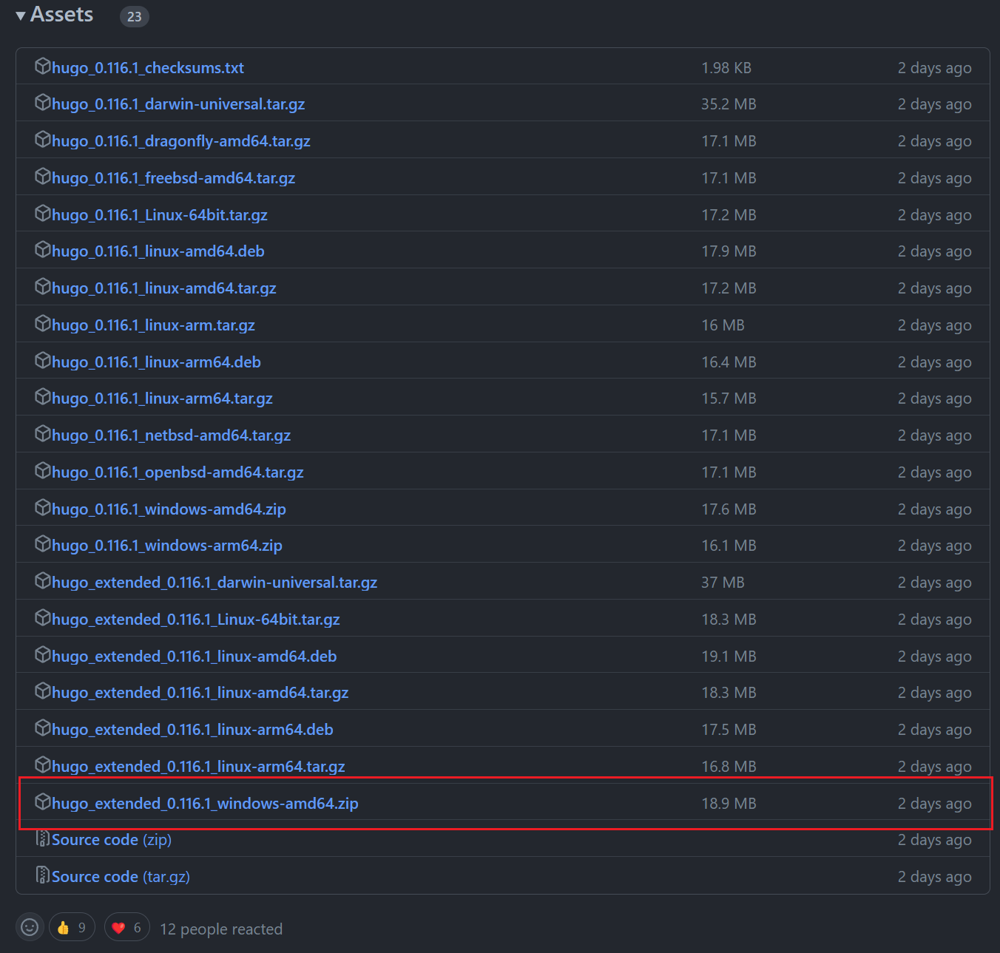
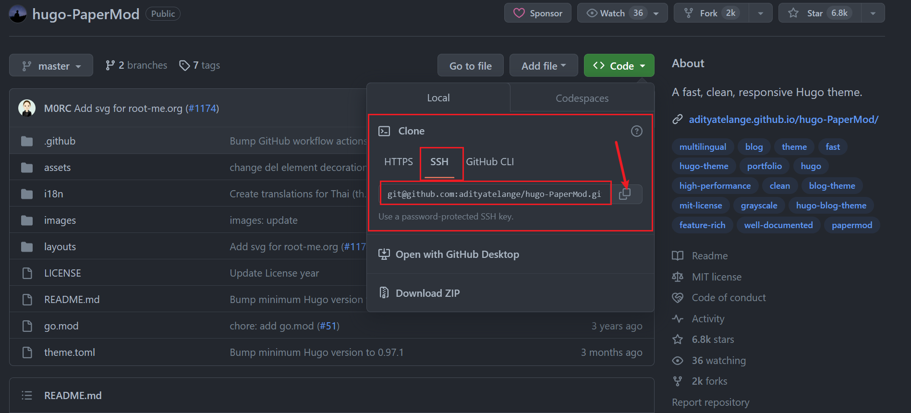

# Hugo |  从零开始云服务器搭建个人博客

---

## 0 前期准备

​		根据网络的查询，`Hugo`不需要像`Hexo`一样安装`Node.js`。但是百度出部分文章前置是说明要安装了 `node.js` , 所以先不管后续用不用得到，先安装。

---

###  0.1 nvm | node

​	`nvm` 是一个node.js 版本控制工具，能够直接安装多种node版本并切换，为后期需要用到旧版本的node或者说当前node版本太低有更换的需求。

进入 power shell ，更改一下脚本执行策略，默认是 Restricted 更改成 remotesigned 。

```powershell
PS C:\Users\YAOGUI> get-executionpolicy
Restricted
PS C:\Users\YAOGUI> get-executionpolicy -list

        Scope ExecutionPolicy
        ----- ---------------
MachinePolicy       Undefined
   UserPolicy       Undefined
      Process       Undefined
  CurrentUser       Undefined
 LocalMachine       Undefined


PS C:\Users\YAOGUI> set-executionpolicy remotesigned
PS C:\Users\YAOGUI> get-executionpolicy -list

        Scope ExecutionPolicy
        ----- ---------------
MachinePolicy       Undefined
   UserPolicy       Undefined
      Process       Undefined
  CurrentUser       Undefined
 LocalMachine    RemoteSigned
```

---

nvm不同系统版本下载地址：

- For Mac/Linux：https://github.com/nvm-sh/nvm
- For Windows：https://github.com/coreybutler/nvm-windows

如果电脑上有node，先卸载（geek）掉node，删除自己配置的node路径文件夹，检查一下路径看看是否还有node或者npm文件夹。

```javascript
C:\Program Files (x86)\Nodejs
C:\Program Files\Nodejs
C:\Users{User}\AppData\Roaming\npm（或%appdata%\npm）
C:\Users{User}\AppData\Roaming\npm-cache（或%appdata%\npm-cache）
```

将之前设置过的Node环境（系统环境和用户环境）里的Node路径全部删除。

检查node和npm，在cmd中输入node-v、npm-v   ， 最后重启系统。


如果电脑上没有node ， 则再相关的github链接中下载对应系统版本的nvm。



下载好之后，将压缩包里的文件都复制出来，再自己设定的一个目录下放置。

个人的目录如下：

```
D:\myEnvironment\nvm
```

配置环境变量，其中 nodejs 为软连接。


在 nvm 文件夹添加settings.txt文件 ，其中设置了硬链接和软连接并更换下载源， 配置如下：

```
root: D:\Environment\nvm
path: D:\Environment\nodejs
arch: 64
proxy: none
node_mirror: https://npm.taobao.org/mirrors/node/
npm_mirror: https://npm.taobao.org/mirrors/npm/
```

使用如下常用命令来安装node以及相关的npm：

```
nvm list -- 查看安装的 node 版本
nvm list available -- 查看所有的node版本

#下载指定版本node
nvm install [ndoe版本号]

#使用指定node版本
nvm use [ndoe版本号] 

node -v -- 查看node版本号
npm -v  -- 查看npm版本号
```

> 注意：在以前安装nvm时出现的问题，个人遇见过两个问题：
>
> 1. 部分node下载后对应的npm就是报错，可能下载时npm没下载成功，官网查看下载node版本对应的npm，手动安装或者笨办法使用nvm卸载之后手动清理文件夹中的npm文件再重下或者下载其他与你项目能兼容的node版本。
>
> 2. 明明换成淘宝源对于国内下载更方便，但是之前换成淘宝源之后总是下载报错，以至于换回官方源反而使用没有任何问题。
>
> 	
>
> 	#改官方源 
> 	npm config set registry http://registry.npmjs.org/


**npm查看全局路径的相关命令**

- 查看当前npm包的全局安装路径

```swift
npm prefix -g 
```

- 查看当前npm包的全局cache路径

```csharp
npm config get cache
```

- 查看配置列表

```undefined
npm config ls
```

- 查看配置列表的全部信息

```undefined
npm config ls -l
```

**npm修改全局路径命令**

- 修改npm的包的全局安装路径

```swift
npm config set prefix "D:\你自己指定的路径\node_global"
```

- 修改npm的包的全局cache位置

```bash
npm config set cache "D:\你自己指定的路径\node_cache"
```


最后可以更改一下node默认的C盘存储路劲，使用上文中的命令查看，发现只有这个node_cache在C盘，所以直接更改这个cache的路劲就行了。

```
PS C:\Users\YAOGUI> npm config ls
; node bin location = D:\Environment\nodejs\node.exe
; node version = v18.17.0
; npm local prefix = C:\Users\YAOGUI
; npm version = 9.6.7
; cwd = C:\Users\YAOGUI
; HOME = C:\Users\YAOGUI
; Run `npm config ls -l` to show all defaults.

PS C:\Users\YAOGUI> npm prefix -g
D:\Environment\nodejs

PS C:\Users\YAOGUI> npm config get cache
C:\Users\YAOGUI\AppData\Local\npm-cache

PS C:\Users\YAOGUI> npm config set cache "D:\Environment\npm_cache"
PS C:\Users\YAOGUI> npm config get cache
D:\Environment\npm_cache
```

在此node的安装步骤就暂时结束了，如果发现更换node版本后，发现设定的全局配置失效或者出现其他报错，互联网浩瀚如海，各位船长还有待探索.   : ) 

感谢如下互联网贡献者的无私分享 ^_^ ：

[如何安装配置Node.js并使用NVM实现多版本共存和无缝切换（Linux/Windows）_哔哩哔哩_bilibili](https://www.bilibili.com/video/BV12h411z7Kq/?spm_id_from=888.80997.embed_other.whitelist&t=74&vd_source=d76e4d3741b8e218984318e9c57578ed)

[nvm安装Node.js与统一的全局模块安装路径的配置 - 简书 (jianshu.com)](https://www.jianshu.com/p/f5a7cedba59b)


---

### 0.2 Go 环境配置

Go 解释器安装网址：[All releases - The Go Programming Language](https://go.dev/dl/)

Go不愧是后来的新语言，进一步拉低编程入门门槛，安装是如此的方便和简单，安装结束之后自动连环境变量都不需要手动配置，并且你还能发现，他把最常用的几个下载的安装程序还给你加粗了，真是贴心啊。下载好之后，双击无脑下一步，除了路径你可以看着办改改，最后直接finish。



**环境变量中的path自动添加安装目录，但是它默认有个gopath路劲，在系统用户变量中，一般默认是C盘的（因为用户文件一般都是C盘），可以改成D盘的自己路劲。**

```
go version -- 弹出版本号则安装成功
```

然后vscode配置go的环境时，下载Code Runner和go语言的扩展，go的扩展出现如下错误提示：

```
The "gopls" command is not available. Run "go install -v golang.org/x/tools/gopls@latest" to install.
```

vscode终端中输入该命令后并没有什么卵用，需要先配置代理然后再下载工具。

```go
go env -w GO111MODULE=on
go env -w GOPROXY=https://goproxy.io,direct

go install -v github.com/ramya-rao-a/go-outline@v0.0.0-20210608161538-9736a4bde949
```

但是看视频说上面方法只能够短暂实现，如果需要长久实现的话需要配置环境变量。

参考 ： [GOPROXY.IO - 一个全球代理 为 Go 模块而生](https://goproxy.io/zh/)

>**Bash (Linux or macOS)**
>
>```shell
># 配置 GOPROXY 环境变量
>export GOPROXY=https://proxy.golang.com.cn,direct
># 还可以设置不走 proxy 的私有仓库或组，多个用逗号相隔（可选）
>export GOPRIVATE=git.mycompany.com,github.com/my/private
>```
>
>**PowerShell (Windows)**
>
>```shell
># 配置 GOPROXY 环境变量
>$env:GOPROXY = "https://proxy.golang.com.cn,direct"
># 还可以设置不走 proxy 的私有仓库或组，多个用逗号相隔（可选）
>$env:GOPRIVATE = "git.mycompany.com,github.com/my/private"
>```
>
>设置完上面几个环境变量后，您的 `go` 命令将从公共代理镜像中快速拉取您所需的依赖代码了。或者，还可以根据[文档](https://goproxy.io/zh/docs/getting-started.html)进行设置使其长期生效。如果您使用的是老版本的 Go（< 1.13）, 我们建议您[升级为最新稳定版本](https://gomirrors.org/)。


参考：

[解决VSCode安装Go tools失败的问题 | L2M2](https://l2m2.top/2020/05/26/2020-05-26-fix-golang-tools-failed-on-vscode/)

---

### 0.3 Hugo 安装 | windows

hugo安装网址： [Releases · gohugoio/hugo (github.com)](https://github.com/gohugoio/hugo/releases)



安装完成后解压到自己指定的文件夹中，并将该文件夹添加到path变量中。

在命令行中使用 hugo version 弹出版本号表示环境变量没问题。

```
PS C:\Users\YAOGUI> hugo version
hugo v0.116.1-3e1ea030a5897addaf9d113d0826709fe07f77c0+extended windows/amd64 BuildDate=2023-08-01T07:24:54Z VendorInfo=gohugoio
```

就此，hugo的安装就结束了。

参考：

[01.Windows下安装Go和Hugo - 知乎 (zhihu.com)](https://zhuanlan.zhihu.com/p/638162331)


---

### 0.4 配置Git

安装Git网上图文教程很多，基本都是无脑下一步，可以根据个人需求再安装的时更改配置。

>以下命令是安装完git后，鼠标右键的git bash here中运行的。

装好后需要配置git ， 相信大家使用git肯定是GitHub或者国内的gitee，这里配置git就以链接上github网址为目的进行书写。

```shell
#用户名与你GitHub上的名字一致。
$ git config --global user.name "Your--name"
#查看是否配置成功
$ git config --global user.name

#配置你github账号的邮箱
$ git config --global user.email "Your--email"
#查看是否配置成功
$ git config --global user.email
```

使用命令生成公钥和私钥，用来和github进行ssh链接。

```shell
#生成密钥，直接三个回车。
ssh-keygen -t ed25519 -C "your_email@example.com"
```

三个回车后默认密钥的名称是 id_ed25519 ， 如果你有多个密钥，则需要 `Enter passphrase (empty for no passphrase):` 后设定自定义名称。

```shell
# 验证 弹出相关pid信息，则没问题。
eval "$(ssh-agent -s)"
Agent pid 1075

#添加密钥
ssh-add ~/.ssh/id_ed25519
#测试链接github
ssh -T git@github.com
```

就此，git的配置就此结束了。

---

## 1.  hugo

选一个你想以后存放博客相关文件的文件夹，再里面鼠标右键进入git bash，使用hugo命令新建博客。

```shell
 # 将
 hugo new site myblog
 
$ cd myblog
$ ls
archetypes/  content/  hugo.toml  static/
assets/      data/     layouts/   themes/

$ ls -l
total 1
drwxr-xr-x 1 35728 197121  0 Aug  3 15:15 archetypes/
drwxr-xr-x 1 35728 197121  0 Aug  3 15:15 assets/
drwxr-xr-x 1 35728 197121  0 Aug  3 15:15 content/
drwxr-xr-x 1 35728 197121  0 Aug  3 15:15 data/
-rw-r--r-- 1 35728 197121 82 Aug  3 15:15 hugo.toml
drwxr-xr-x 1 35728 197121  0 Aug  3 15:15 layouts/
drwxr-xr-x 1 35728 197121  0 Aug  3 15:15 static/
drwxr-xr-x 1 35728 197121  0 Aug  3 15:15 themes/
```

选一个自己美美的主题，将主题给下载下来。

*在github上下载主题文件得方法：*

hugo主题： [Complete List | Hugo Themes (gohugo.io)](https://themes.gohugo.io/)

在myblog的themes目录下，打开git bash ，输入下列命令：



```
git clone [你博客的github链接] [文件名]
# 例如我选择的papermod主题。
git clone git@github.com:adityatelange/hugo-PaperMod.git papermod
```

尝试本地启动主题查看效果，每次渲染的时候需要在根目录下输入该命令。

```
# 浏览器输入 localhost：1313 查看效果
hugo server -t [主题文件名称] --buildDrafts

# --buildDrafts 参数表示显示包含草稿在内的所有文章
# -w 表示监控更改，本地修改保存后立即同步，在网页上实时显示
hugo server --buildDrafts -w

# hugo 常用命令 
# 新建文章在 content/posts/ 下
hugo new content/posts/[文章名称].md     
```


### 1.1 个人博客美化

一般提供博客的开源项目中会有文档可供参考，当然也可以百度相关的博客名称，找到网络上别人已近分享出来的配置好的配置文件。一般都是hugo.toml文件中配置。

#### YAML

博客配置文件为了可读性很多人都会选择YAML，直接改文件名后缀就行。

语法：

1. 使用缩进表示层级关系，每行开始的空格数量多少没关系，只要相同层级的元素左对齐即可。
2. #号用来表示注释
3. 基本数据关系：纯量、数组、对象。
	1. 纯量：不可再分的值，字符串、时间、日期、Null、布尔、整数、浮点。
	2. 其中 null 或者 ~ 号表示空值。
	3. 日期和时间需要使用  ISO 8601


**ISO 8601**

```yaml
#comment here
#日期的格式
data:2023-8-29
#时间需要在日期后使用T分割，结尾附加时区。
time：2023-8-29T14:48:33+08：00
```

**分段长字符串**

在冒号后打空格接右位移符，会将下方多段的字符拼接成一个长字符。

保留最后一行的结尾换行符，其余的换行符替换长空格。

```yaml
longString: >
    this is a long string
    I need to branch this string
    bala bala..。

# this is a long string I need to branch this string bala bala...
```

如果保留结尾的换行符，则 > 换成 | 就行。

```yaml
longString: |
    this is a long string
    I need to branch this string
    bala bala..。

# this is a long string\nI need to branch this string\nbala bala...\n

```

**YAML-数组**

数组有两种写法，第一种适应复杂情况下混合式数组，第二种适合数组元素都是纯量的数组。

```yaml
# 第一种写法
prots1:
- element1
- element2
- element3
#元素前方保持对齐情况下有无缩进都行
prots2:
    - element1
    - element2
    - element3	
#第二种写法
prost3: [11,22,33]
```

**YAML-对象**

```yaml
container:
	name:mysql
	password:123456
	version:5.7
```

---

## 2.配置服务器

阿里云中的Ubuntu的根目录下的文件使用分别如下：

```
/bin: 存放二进制可执行文件，这些文件通常是系统启动时必须的程序，如 ls、cp 等。
/boot: 存放启动 Ubuntu 所需的文件，如内核文件和引导加载程序。
/dev: 存放设备文件，Ubuntu 中的每个硬件设备都在此目录下表示为一个文件。
/etc: 存放系统配置文件，如网络配置、用户管理等。
/home: 存放用户主目录，每个用户都有一个独立的子目录。
/lib,/lib32,/lib64,/libx32: 存放库文件，这些文件包含程序运行所需的函数和代码。
/lost+found: 一般为空，文件系统发生错误时，文件可能会被丢失或损坏，这些文件会被放到此目录下。
/media: 存放可移动设备（如 USB 驱动器）挂载点。
/mnt: 临时挂载目录，可以将其他文件系统挂载到此目录下。
/opt: 存放第三方软件安装包。
/proc: 虚拟文件系统，存放系统内核和运行时信息。
/root: 超级用户（root）的主目录。
/run: 存放系统运行时的临时文件，如进程 ID 文件等。
/sbin: 存放系统管理员使用的二进制可执行文件，如 ifconfig、iptables 等。
/snap: 存放 Snap 包管理器安装的软件包。
/srv: 存放服务数据，如 Web 服务器存放网站数据等。
/sys: 虚拟文件系统，提供了与硬件设备相关的信息。
/tmp: 存放临时文件，这些文件在系统重启后会被删除。
/usr: 存放用户安装的应用程序和文件，如 Python、GCC 等。
/var: 存放系统日志、缓存和其他可变数据。
```

先更新一下ubuntu中的软件库，并下载所需程序。

弹出对应的程序的版本号则表示该程序安装没问题。

~~~shell
sudo apt update
--------------------------------------
#安装vim
sudo apt-get install vim
#验证是否安装成功
vim --v
--------------------------------------
#安装git
sudo apt-get install git
#验证是否安装成功
git --version
--------------------------------------
~~~

创建git用户并验证是否创建成功，如果显示创建的用户名则没问题。

~~~
 #创建用户
 sudo useradd gitUser
 #查看是否创建成功
 cut -d: -f1 /etc/passwd
 #给指定用户添加密码
 sudo passwd gitUser
~~~

Ubuntu系统会默认创建一些用户

~~~
root 用户账户是系统管理员账户，具有最高权限。
daemon、bin、sys、sync、games、man、lp、mail、news、uucp、proxy、www-data、backup、list、irc、gnats 和 nobody 等用户账户是系统默认创建的一些账户，用于执行系统进程和服务。
_apt 用户账户是用于管理 APT 软件包管理器的账户。
systemd-network、systemd-resolve、messagebus 和 systemd-timesync 等用户账户是用于管理系统服务和进程的账户。
sshd 用户账户是用于 SSH 服务的账户。
syslog 用户账户是用于日志记录的账户。
usbmux 用户账户是用于 USB 设备管理的账户。
lxd 用户账户是用于 LXD 容器管理的账户。
ntp 和 _chrony 用户账户是用于网络时间协议 (NTP) 服务的账户。
~~~

---

### 安装caddy

caddy 是一个轻量级的 web 服务端，可以提供 http 服务。功能不如 Apache/Nginx 强大但是可以自动从 GitHub 上拉取更新到本地，并且能自动申请 ssl 证书，避免访问时的不安全网站提醒。

官方文档：[Install — Caddy Documentation --- 安装-盒文档 (caddyserver.com)](https://caddyserver.com/docs/install#debian-ubuntu-raspbian)

Ubuntu  22.04 64位caddy（稳定版本）安装命令如下：

~~~
sudo apt install -y debian-keyring debian-archive-keyring apt-transport-https
这个命令会安装 debian-keyring、debian-archive-keyring 和 apt-transport-https 软件包。这些软件包是用于验证 Debian 存储库中软件包的身份验证和传输协议的必要工具。

curl -1sLf 'https://dl.cloudsmith.io/public/caddy/stable/gpg.key' | sudo gpg --dearmor -o /usr/share/keyrings/caddy-stable-archive-keyring.gpg
这个命令会使用 curl 下载 Caddy 的 GPG 密钥，并使用 gpg 命令将其解密并保存到 

/usr/share/keyrings/caddy-stable-archive-keyring.gpg 
文件中，这个密钥将用于验证 Caddy 软件包的身份验证。

curl -1sLf 'https://dl.cloudsmith.io/public/caddy/stable/debian.deb.txt' | sudo tee /etc/apt/sources.list.d/caddy-stable.list
这个命令会使用 curl 下载 Caddy 的 Debian 存储库文件，并使用 tee 命令将其写入 

/etc/apt/sources.list.d/caddy-stable.list 
文件中。这个文件将告诉 apt 命令从哪里下载 Caddy 软件包。

sudo apt update
这个命令会更新系统的软件包索引，以便系统能够找到并下载最新版本的 Caddy 软件包。

sudo apt install caddy
这个命令会使用 apt 命令从 Caddy 的 Debian 存储库中下载并安装 Caddy 软件包。安装完成后，您可以使用 systemctl 命令启动、停止和管理 Caddy 服务。
~~~

---

*以下类容都是面向chatGPT生成*


**为caddy创建独立用户和用户组**

为 Caddy 创建一个独立的用户和用户组：

创建一个新的 caddy 用户：

```
sudo useradd --system --home /var/lib/caddy --shell /usr/sbin/nologin --comment "Caddy web server" caddy
```

 这个命令会创建一个新的 caddy 用户，该用户将作为 Caddy 服务的运行用户，并将其配置为系统用户（--system）、设置主目录为 /var/lib/caddy、设置默认 shell 为 /usr/sbin/nologin、并添加一个注释。

创建一个名为 caddy 的新用户组。使用以下命令创建该用户组：

```
sudo groupadd caddy
```


然后，将 caddy 用户添加到 caddy 用户组中。使用以下命令将 caddy 用户添加到 caddy 用户组：

```
sudo usermod -aG caddy caddy
```


这个命令将 caddy 用户添加到 caddy 用户组中，使得该用户可以访问该组的权限和资源。

现在，已经成功创建了一个名为 caddy 的新用户和用户组，可以将 Caddy 服务配置为使用该用户和组来运行。

 Caddy 创建必要目录并为 caddy 用户赋予相关目录权限：

```
sudo mkdir -p /etc/caddy /var/log/caddy /var/www
```

这个命令将创建 /etc/caddy、/var/log/caddy 和 /var/www 三个目录。其中，/etc/caddy 目录将用于存储 Caddy 的配置文件，/var/log/caddy 目录将用于存储 Caddy 的日志文件，/var/www 目录将用于存储 Web 服务器的网站文件。

接下来为 caddy 用户赋予相关目录权限。使用以下命令将 caddy 用户添加到 www-data 用户组中：

```
sudo usermod -aG www-data caddy
```

这个命令将 caddy 用户添加到 www-data 用户组中，使得该用户可以访问 /var/www 目录中的网站文件。然后，使用以下命令为 /etc/caddy 和 /var/log/caddy 目录设置正确的权限：

```
sudo chown -R root:root /etc/caddy
sudo chmod 755 /etc/caddy

sudo chown -R caddy:root /var/log/caddy
sudo chmod 750 /var/log/caddy
```

这个命令将 /etc/caddy 目录设置为只有 root 用户可以写入，其他用户只能读取和执行。将 /var/log/caddy 目录设置为只有 caddy 用户和 root 组可以写入，其他用户只能读取和执行。

现在，您已经成功为 Caddy 创建了必要的目录并为 caddy 用户赋予了相关目录权限。


**为caddy配置相关权限**

在为 Caddy 创建必要目录并为 caddy 用户赋予相关目录权限之后，可按照以下步骤安装 systemd 服务配置文件：

以创建一个新的 Caddy 配置文件：

```
sudo nano /etc/systemd/system/caddy.service
```

这个命令将打开一个名为 caddy.service 的空文件，并使用 nano 编辑器进行编辑。

在编辑器中，复制以下内容并粘贴到 caddy.service 文件中：

```
[Unit]
Description=Caddy HTTP/2 web server
Documentation=https://caddyserver.com/docs/
After=network.target

[Service]
User=caddy
Group=www-data
ExecStart=/usr/bin/caddy run --environ --config /etc/caddy/Caddyfile
ExecReload=/usr/bin/caddy reload --config /etc/caddy/Caddyfile
TimeoutStopSec=5s
LimitNOFILE=1048576
LimitNPROC=512
PrivateTmp=true
ProtectSystem=full
AmbientCapabilities=CAP_NET_BIND_SERVICE

[Install]
WantedBy=multi-user.target
```

这个配置文件定义了 Caddy 服务的系统服务单元，指定了服务的用户、组、启动命令、配置文件路径和其他相关设置。

保存并关闭文件，然后使用以下命令重新加载 systemd 服务配置文件：

```
sudo systemctl daemon-reload
```

最后使用以下命令启动 Caddy 服务：

```
sudo systemctl start caddy
```


这将启动 Caddy 服务并开始监听默认的 HTTP 端口 80。您可以使用以下命令检查 Caddy 服务的状态：

```
sudo systemctl status caddy
```

现在，您已经成功安装了 Caddy 的 systemd 服务配置文件，并将其配置为使用 caddy 用户和 www-data 组来运行。


**关闭或者启动caddy**

使用 systemctl 命令来启动、停止、重启或重新加载 Caddy 服务。

```
#要启动 Caddy 服务，请使用以下命令：
sudo systemctl start caddy
#要停止 Caddy 服务，请使用以下命令：
sudo systemctl stop caddy
#要重启 Caddy 服务，请使用以下命令：
sudo systemctl restart caddy
#要重新加载 Caddy 服务，请使用以下命令：
sudo systemctl reload caddy
```

当您更改了 Caddy 配置文件时，可以使用 reload 命令重新加载配置，而不需要停止和启动服务。这将允许 Caddy 在不间断服务的情况下应用新的配置。


在博客站点文件夹中创建public文件，Hugo的`public`文件夹是一个特殊的文件夹，用于存储静态文件，比如CSS、JavaScript、图片等。Hugo在生成站点时会自动复制`public`文件夹中的文件到输出目录。

1. 在你的Hugo项目的根目录下创建一个名为`public`的文件夹（如果还没有的话）。
2. 将你的静态文件放入`public`文件夹中。这些文件可以是CSS文件、JavaScript文件、图片或其他任何类型的静态文件。
3. 运行Hugo命令来生成站点。Hugo将会自动复制`public`文件夹中的文件到输出目录。

假设Hugo项目的根目录是`/myblog`，可以在`/myblog/public`文件夹中放置一个名为`style.css`的CSS文件。运行Hugo命令生成站点后，该CSS文件将会被复制到输出目录中的相应位置。

---

修改Caddyfile文件

```shell
sudo vi /etc/caddy/Caddyfile
```


---

参考：

[Quick start | Hugo (gohugo.io)](https://gohugo.io/getting-started/quick-start/)

[Features · adityatelange/hugo-PaperMod Wiki --- 特色· adityatelange/hugo-PaperMod Wiki (github.com)](https://github.com/adityatelange/hugo-PaperMod/wiki/Features#regular-mode-default-mode)

[hugo博客搭建 | PaperMod主题_hugo 安装主题_素履、的博客-CSDN博客](https://blog.csdn.net/Xuyiming564445/article/details/124647299)

根据参考修改了文章目录的位置：

https://www.sulvblog.cn/posts/blog/hugo_toc_side/


Caddy is ready to serve your site over HTTPS:
Caddy已准备好通过HTTPS为您的网站提供服务：

1. Point your domain's A/AAAA DNS records at this machine.
	将域的A/AAAA DNS记录指向此机器。

2. Upload your site's files to `/var/www/html`.
	上传您网站的文件到 `/var/www/html` 。

3. Edit your Caddyfile at

	```
	/etc/caddy/Caddyfile
	```


	在 `/etc/caddy/Caddyfile` 编辑您的Caddyfile：
	
	1. Replace `:80` with your domain name
		将 `:80` 替换为您的域名
	2. Change the site root to `/var/www/html`
		将站点根目录更改为 `/var/www/html`

4. Reload the configuration: `systemctl reload caddy`
	重新加载配置： `systemctl reload caddy`

5. Visit your site! 访问您的网站！


## If that didn't work 😶 如果这不起作用？？

It's okay, you can fix it! First check the following things:
没事的你能修好的！首先检查以下事项：

- Service status: `systemctl status caddy` 服务状态： `systemctl status caddy`
- Logs: `journalctl --no-pager -u caddy` 日志： `journalctl --no-pager -u caddy`
- Are your site's files readable by the caddy user and group? `ls -la /var/www/html`
	您的网站文件是否可以被Caddy用户和组读取？ `ls -la /var/www/html`
- Is the caddy home directory writeable? `ls -la /var/lib/caddy`
	caddy主目录是可写的吗？ `ls -la /var/lib/caddy`
- Ensure your domain's A and/or AAAA records point to your machine's public IP address: `dig example.com`
	确保域的A和/或AAAA记录指向计算机的公共IP地址： `dig example.com`
- Are your ports 80 and 443 externally reachable, and is Caddy able to bind to them? Check your firewalls, port forwarding, and other network configuration.
	您的端口80和443是否可以外部访问，Caddy是否能够绑定到它们？检查防火墙、端口转发和其他网络配置。

**WAIT!** Before trying again, switch to [Let's Encrypt's staging environment](https://letsencrypt.org/docs/staging-environment/) to avoid being accidentally [rate limited](https://letsencrypt.org/docs/rate-limits/). Once you get everything else working, it's safe to switch back.
等等！在重试之前，请切换到Let's Encrypt的暂存环境，以避免意外地受到速率限制。一旦你把其他东西都修好了，就可以安全地换回去了。

Depending on your DNS provider, it may take a while for the DNS records to propagate. Even when everything is configured properly, automated challenges to obtain TLS certificates usually take several seconds, but may take up to several minutes or hours.
根据您的DNS提供商，DNS记录可能需要一段时间才能传播。即使所有内容都配置正确，获取TLS证书的自动挑战通常需要几秒钟，但可能需要几分钟或几小时。

If you still need help, we have a [great community](https://caddy.community/)! First [try a search](https://caddy.community/search), and if your question is original, go ahead and ask it! Remember to pay it forward and help others too. 😁
如果你还需要帮助，我们有一个伟大的社区！首先尝试搜索，如果你的问题是原创的，继续问吧！记住要把它转发出去，也要帮助别人。笑